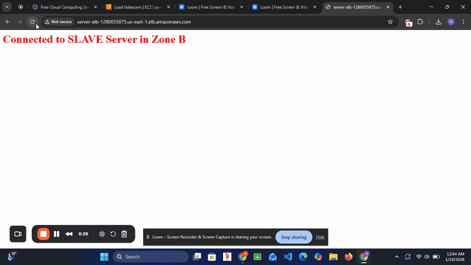

# High-Availability Web Cluster on AWS ☁️

**Status:** ✅ Deployed & Tested
**Role:** Cloud Engineer

---

### 🚀 Project Demo
*(Traffic automatically rerouting between Zone A and Zone B upon page refresh)*

🔹 **[Watch the Full Technical Walkthrough (Loom Video)](https://www.loom.com/share/66298914a17c4b99bd94d6472b49876d)**

---

### 🏗 Architecture Design
This project implements a "Multi-AZ" architecture. If one physical data center (Availability Zone) goes offline, the Load Balancer instantly shifts traffic to the backup zone, ensuring 0% downtime.

---

### 🎯 Objective
To engineer a fault-tolerant web application infrastructure that eliminates single points of failure (SPOF) using AWS Elastic Load Balancing and distributed networking.

### 🛠 Tech Stack
* **Cloud Provider:** Amazon Web Services (AWS)
* **Networking:** VPC, Public Subnets, Internet Gateway, Route Tables
* **Traffic Management:** Application Load Balancer (ALB) - Internet Facing
* **Compute:** EC2 (Amazon Linux 2023)
* **Automation:** Bash User-Data Scripts (for bootstrapping Nginx)
* **Security:** Stateful Security Groups (Least Privilege Model)

---

### ⚙️ Implementation Steps

#### 1. Network Engineering (VPC)
* Designed a custom VPC (`10.0.0.0/16`) to isolate network traffic.
* Created two distinct public subnets in separate physical locations:
    * **Subnet A:** `us-east-1a`
    * **Subnet B:** `us-east-1b`
* Configured a custom Route Table and Internet Gateway to allow public access.

#### 2. Server Deployment & Automation
* Launched **EC2 Instances** using a "Golden Image" (AMI) strategy.
* Wrote **Bash User-Data scripts** to automate the server setup:
    * Updated system packages (`yum update`).
    * Installed and started the **Nginx** web server.
    * Injected dynamic HTML code to visually identify which Zone is serving the traffic (Blue for Zone A, Red for Zone B).

#### 3. Load Balancing & Security
* Deployed an **Application Load Balancer (ALB)** listening on Port 80.
* Created a **Target Group** with health checks to monitor instance status.
* **Security Hardening:** Configured Security Groups to allow HTTP traffic *only* from the Load Balancer, blocking direct IP attacks on the servers.

---

### 🧪 Testing & Validation
1.  **Health Check:** Confirmed both Target Instances were "Healthy" in the ALB dashboard.
2.  **Traffic Test:** Accessed the ALB DNS Name (`server-alb-....amazonaws.com`).
3.  **Failover Simulation:** Repeatedly refreshed the browser to observe the "Round Robin" algorithm distributing traffic evenly between the Master (Blue) and Slave (Red) servers.
